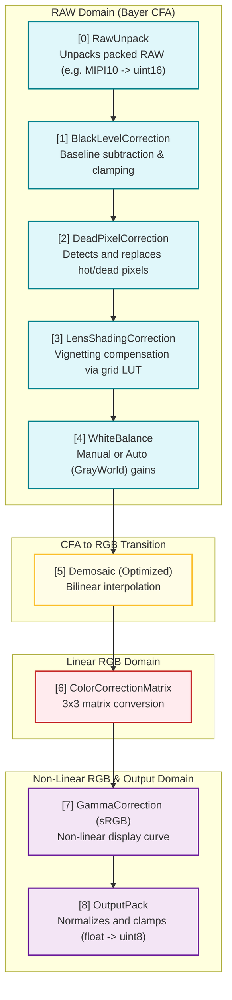

# cuda_isp — CUDA Camera ISP Pipeline

一个用 CUDA 实现的相机 ISP（Image Signal Processor）流水线，把 raw Bayer 传感器数据处理成 RGB PNG。每个 ISP block 是独立的 `.cu` kernel，通过 `ISPPipeline` 串起来，自带逐 block 计时。

当前实现的 block：
- **raw_unpack** — MIPI10 / packed → uint16
- **black_level** — 黑电平校正（naive + optimized 两版）
- **auto_white_balance** — 白平衡：Manual（固定增益）+ GrayWorld（GPU 上统计每通道均值并计算增益，全程无 host 往返）
- **demosaic** — 双线性去马赛克，支持 RGGB / BGGR / GRBG / GBRG（编译期模板特化）
- **len_shading_correction** — 镜头阴影校正（通过 2D 查找表 LUT 双线性插值进行通道增益补偿）
- **color_correction_matrix** — 3×3 sensor RGB → target RGB 颜色校正矩阵
- **gamma** — sRGB gamma 校正（float）
- **output_pack** — float → uint8

## ISP 流水线架构 (Pipeline Architecture)

以下是 `cuda_isp` 当前的完整数据流水线与处理域划分图：



## 目录结构

```
cuda_isp/
├── blocks/          # 每个 ISP block 一个 .cu 文件
├── include/         # 公共头文件（FrameBuffer / ISPBlock / pipeline 等）
├── src/             # 主程序 + pipeline driver + frame loader
├── tests/           # GoogleTest 单测 + Performance_4K 性能测试
├── tools/           # synthetic_gen.py（造测试 raw 数据）
├── data/            # 测试 raw + JSON sidecar
├── third_party/     # stb_image / stb_image_write
└── CMakeLists.txt
```

## 依赖

- CUDA Toolkit（>= 11，建议 12.x）
- CMake >= 3.25
- C++17 编译器
- Python 3 + numpy + Pillow（仅当用 `tools/synthetic_gen.py` 时）

`nlohmann/json` 和 `googletest` 由 CMake `FetchContent` 自动拉取，第一次 configure 时需要联网。

## Build

标准 out-of-source 构建：

```bash
cmake -B build
cmake --build build -j 8
```

说明：
- 默认走 **Release**（`CMakeLists.txt` 强制设置，避免空 build type 关掉 NDEBUG）。Debug 用 `cmake -B build -DCMAKE_BUILD_TYPE=Debug`。
- 默认构建 `75;80;86;89` 四个常见 GPU 架构的 SASS；可用
  `-DCMAKE_CUDA_ARCHITECTURES=<arch>` 覆盖。
- 产物：`build/cuda_isp`（主程序）、`build/tests/isp_tests`（测试二进制）。
- `build/compile_commands.json` 已导出，根目录有软链接给 clangd 用。

## Run

```bash
./build/cuda_isp <input.raw> [output.png]
```

每个 `.raw` 必须配一个同名 `.json` sidecar（程序自动把 `.raw` 后缀替换为 `.json`），描述 sensor 元信息：

```json
{
  "width": 1920,
  "height": 1080,
  "bit_depth": 10,
  "bayer_pattern": "RGGB",
  "packing": "mipi10",
  "black_level": 64,
  "white_level": 1023
}
```

字段说明：
- `bayer_pattern`: `RGGB` / `BGGR` / `GRBG` / `GBRG`
- `packing`: `mipi10`（5 字节 4 像素）/ `unpacked_u16`（每像素 2 字节小端 uint16）/ `unpacked_u8`（每像素 1 字节，要求 `bit_depth ≤ 8`）
- `bit_depth`: 1–16；常见 8 / 10 / 12
- `black_level`: 黑电平，必须位于 sensor code range 内
- `white_level`（可选）: 传感器饱和值，默认 `(1 << bit_depth) - 1`，必须大于 `black_level`
- `white_balance_gains`（可选）: `{ "r": .., "gr": .., "gb": .., "b": .. }`，
  须为 finite 正数；存在时使用 Manual 白平衡，省略时使用 GrayWorld AWB
- `color_correction_matrix`（可选）: row-major 3×3 矩阵，写成 9 个 finite
  数字的 flat array；默认 identity。真实 sensor → sRGB 输出需要填入标定矩阵
- `lsc_grid_width` / `lsc_grid_height`（可选）: LSC 标定网格维度（必须 >= 2），默认均为 `2`
- `lsc_lut`（可选）: LSC 校正查找表，写成包含 4 个通道（顺序为 R, Gr, Gb, B）数组的 2D 数组，每个通道包含 `lsc_grid_width * lsc_grid_height` 个正数；默认全为 `1.0f`（不校正）
- `enable_blc` / `enable_dpc` / `enable_lsc` / `enable_wb` / `enable_demosaic` / `enable_ccm` / `enable_gamma` / `enable_output_pack`（可选）: 运行时开启或关闭相应 block（默认为 `true`，设为 `false` 可实现动态 Bypass）

例子：

```bash
# 正常运行单帧
./build/cuda_isp data/test_rggb_1920x1080_10bit.raw output.png

# 连续执行 100 次（Benchmark 稳态性能）
BENCH_ITERS=100 ./build/cuda_isp data/test_rggb_1920x1080_10bit.raw output.png
```

输出会打印每个 block 的耗时 + 总耗时。

设 `BENCH_ITERS=N` 可对同一帧连续跑 N 次，用于测稳态性能：第一帧支付一次性
buffer 分配，后续帧复用 pipeline 的 buffer 池（不再 `cudaMalloc`），并始终走
零拷贝 `execute()`。Packed RAW / unpacked_u8 每轮都会由 RawUnpack 重新生成
uint16 工作 buffer；`unpacked_u16` 输入会被 in-place block 反复修改，因此最终
保存的 PNG 只适合辅助观察，benchmark 关注的是稳态耗时。

### 造测试数据

用任意 PNG/JPEG mosaic 成 Bayer raw：

```bash
python3 tools/synthetic_gen.py --input input.png --output data/my_test.raw \
    --width 1920 --height 1080
```

脚本会顺带生成对应的 `.json` sidecar。

## Test

测试用 GoogleTest，通过 `gtest_discover_tests` 自动注册到 CTest，两种跑法：

```bash
# 用 ctest（推荐：并行 + summary）
ctest --test-dir build --output-on-failure
ctest --test-dir build -j8                    # 并行
ctest --test-dir build -R Demosaic            # 只跑名字含 Demosaic 的

# 直接跑 gtest 二进制（filter 更灵活，能看完整 stdout）
./build/tests/isp_tests
./build/tests/isp_tests --gtest_filter='*Performance_4K*'
./build/tests/isp_tests --gtest_list_tests
```

核心 block 有 correctness 单测；RawUnpack / BLC / Demosaic / Gamma 另有
`Performance_4K` 基准（带 warm-up + 多次 loop + GB/s 吞吐量）。

## 开发笔记

- 想加新 block：在 `blocks/` 下放一个 `.cu`，在 `include/blocks.h` 里加 factory 声明，CMake 根目录的 `file(GLOB)` 会自动捡起来。**注意当前根目录 glob 没加 `CONFIGURE_DEPENDS`，新增 `.cu` 要手动重跑 `cmake -B build` 一次。**
- `FrameBuffer` 用 plain `cudaMalloc`，没有 pitched 内存；`stride` 字段当前其实是 `row_bytes`。
- Pipeline 的输入/所有权契约：`execute(FrameBuffer&)` 默认零拷贝，in-place
  block 会修改输入，调用方应把 input 视为已消费；`executePreservingInput()`
  显式增加一次 device-to-device staging copy。返回值始终是**非拥有视图**，
  可能 alias input 或 pipeline-owned buffer，调用方不得 `.free()`。
- Pipeline 已支持 sensor-to-target RGB 的 3×3 CCM；sidecar 未提供矩阵时使用
  identity，因此未标定配置的 PNG 仍不应视为颜色准确的最终成像结果。

后续 TODO 见 `TODO.md`。
